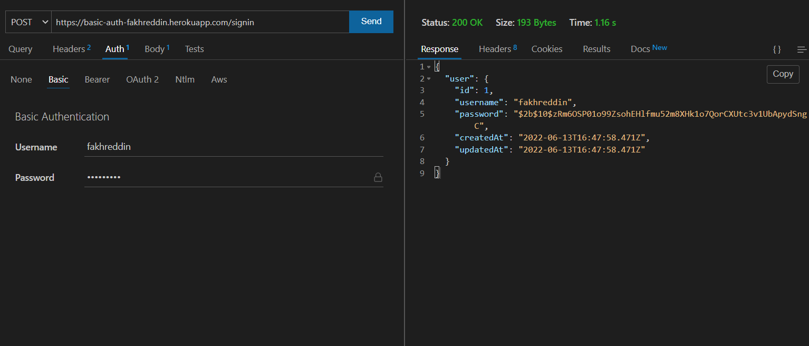
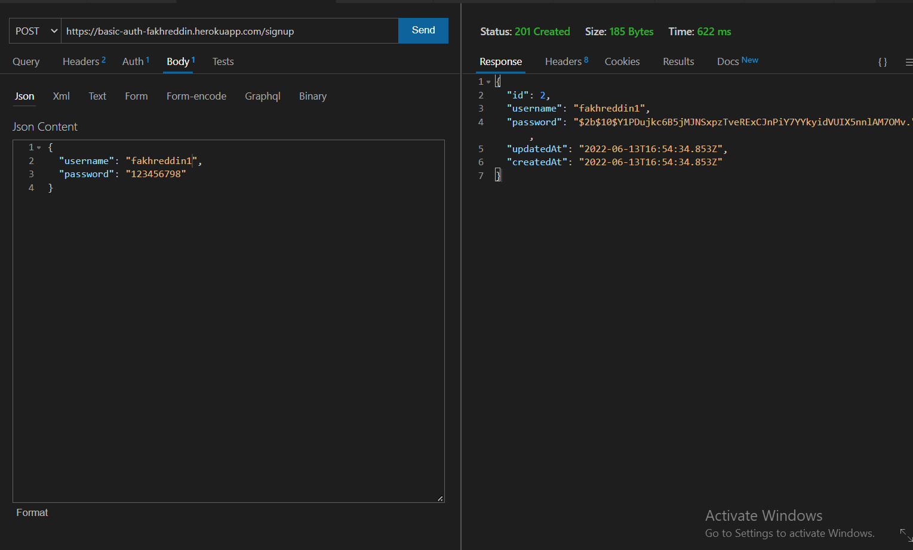
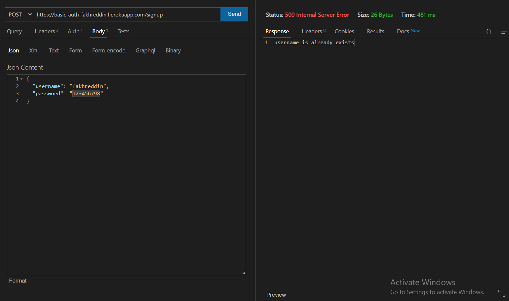
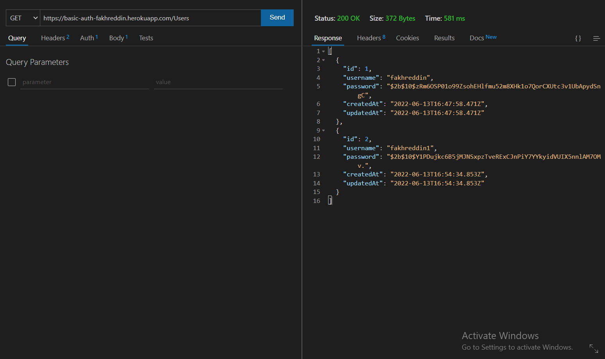
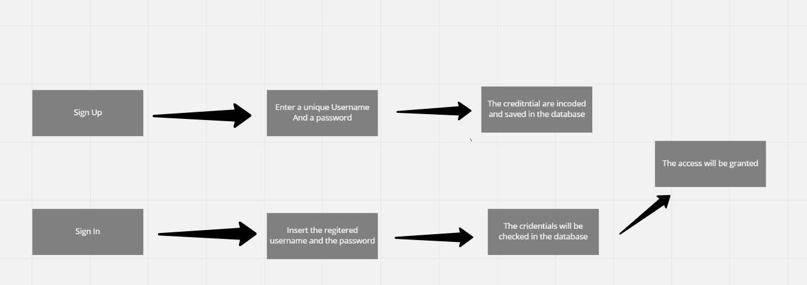

# basic-auth

* [Heroku-App](https://basic-auth-fakhreddin.herokuapp.com/)
* [Pull requests](https://github.com/h4mz411y/basic-auth/pulls?q=is%3Apr+is%3Aclosed)
* [Github link](https://github.com/h4mz411y/basic-auth)

# Testing
* Sign in

* Sign up

* User already exists

* All users

# UML 

